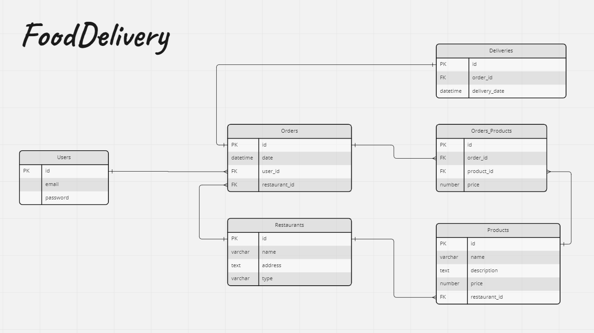

# Modular food delivery

### Powód:

> Poznanie `Nest.js` na praktycznym, miniprojektowym przykładzie. Sposób organizacji projektu. Wykorzystanie dobrych praktyk. Podział na moduły.

---
        


### Narracja:

Czas przedstawić założenia z diagramu encji w _Food Delivery_ w bardziej poukładany — modułowy sposób. Twoim zadaniem jest przełożenie podobnych koncepcji z przygotowania projektu _FD_ w tygodniu `2`. Jednak tym razem `API` zrobimy w `Nest.js`.
Nie potrzebujemy mieć spiętej bazy danych ani migracji czy repozytoriów.

Zależy nam jedynie na Twoim pomyśle na organizację projektu wg. koncepcji modułów w `Nest.js`.

To znaczy, klasycznie podział elementów na back-end charakteryzował się podziałem `per-type`: 
```
src   
  \ controllers
  \ models
  \ middlewares
  \ exceptions
  
  ... etc... 
```

Tym razem chcemy, żeby te elementy mieszkały razem, ze swoim `feature` na przykład: 
```
src
  \ user
    |- users.controller.ts
    |- users.service.ts
    |- auth.middleware.ts
    |- user-exceptions.ts
    |- auth-user.dto.ts
    |- user.ts
```

Dane mają być przechowywane na razie jako `in-memory`. Nie musisz implementować całej logiki obsługi _FoodDelivery_, ale przygotuj wszystkie potrzebne _endpointy_ i dostęp _resources_.
                                         
Jeśli chcesz możesz przedstawić część implementacji bazy `in-memory` jako `Repository`, aby przećwiczyć ten pattern. W tym układzie pełny podział warstwowy Twojej aplikacji będzie reprezentowany jako:
`Controller` > `Service` > `Repository` + `in-memory` + `Models` (_interfaces_)
                                         

---

Główne problemy projektu:
 - trzeba przygotować podział elementów i wydzielić moduły
 - całość budujemy od `0` ale z wykorzystaniem generatora `@nestjs/cli`!

### Zadanie:

1. Użyj _Nest.js_ oraz jego narzędzi do scaffold'u projektu (Projekt wygeneruj tutaj jako [food-delivery](./food-delivery))
2. Zaplanuj i utwórz modele danych (Mogą być to po prostu interfejsy)
3. Zaplanuj moduły i ich podział
4. Dodaj controller'y i serwisy
5. "Fake data" trzymaj jako `in-memory` (mogą być na poziomie serwisów)

